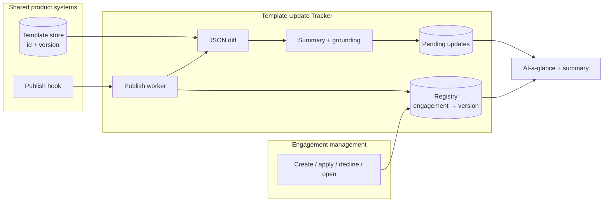

# Engagement Template Update Tracker

Design for Caseware take-home: tell practitioners, at a glance, which engagement files have pending product-template updates, and give them a human-readable summary of inbound changes so they can apply or decline — without opening each engagement (~1 minute per file).

Applying template content is out of scope. This document is the primary deliverable; the Java slice proves the contracts.

## Assumptions

- Template versions are monotonic integers assigned at publish time.
- Engagement management already creates files and processes apply/decline. We add hooks on those actions and on template publish.
- Decline means “stay on the currently applied version and dismiss this target version.” A later publish reopens the decision. The summary is always *applied → latest*, so previously declined content still appears if it remains in the latest template — that is honest.
- The registry stores only `(firmId, engagementId, templateId, appliedVersion)`. No financial data.
- Content-authored release notes, when present, are the preferred headline. Generated text is a fallback and must be grounded in the JSON diff.

## 1. High-level architecture

The hard constraint is that **reading template version from an engagement requires loading it**. Therefore this feature cannot scan engagement files at publish time. Version is captured when the engagement system already has the file in memory (create, apply, decline, and later: ordinary open) and projected into a queryable **Engagement Template Registry**.

**Publish path (infrequent, ~weekly per product):** load the new template version (fast), query the registry for `templateId AND appliedVersion < newVersion`, compute the JSON diff **once per distinct `(templateId, fromVersion, toVersion)`**, generate a grounded human-readable summary, and upsert pending rows. Hundreds of engagements on the same version share one diff.

**Read path:** `listAtAGlance(firmId)` is a straightforward query. Detail is the pending summary plus per-hop changelog when multiple publishes stacked up.

**Decision path:** engagement management loads the file (unavoidable, out of scope) and emits `DecisionEvent(engagementId, APPLY|DECLINE, targetVersion)`. The tracker updates the registry and **re-syncs** pending state so a newer publish that landed during the ~1 minute load is not lost.

AWS shape (they are an AWS shop): EventBridge for hooks, SQS for at-least-once publish/decision handling, DynamoDB (or Aurora) for registry + pending keyed by `firmId`, existing template DB, Lambda/ECS worker, optional Bedrock for wording, CloudWatch + X-Ray.

## 2. Implementation plan

1. **Contracts** — event schemas: `EngagementCreated`, `TemplatePublished`, `DecisionEvent`. Registry and pending-update ports.
2. **Registry + hooks** — write on create; update on apply/decline; opportunistic repair when an engagement is opened (already paying the load cost).
3. **Publish worker** — fan-out by unique applied version; cache diffs/summaries; materialize pending rows. Handle stacked publishes by replacing the pending record with accumulated `applied → latest` plus hops `vN→vN+1`.
4. **Human-readable summary** — deterministic mapping from JSON diff for correctness; optional LLM rewrite that must cite diff paths; prefer content-team release notes as headline.
5. **UI** — pending badge on the firm engagement list; summary panel; apply/decline already in engagement management.
6. **Reconciliation** — not a fleet-wide load. Drift is repaired on open and by a sampled, rate-limited job only if metrics show index lag.

The Java module in this repo is steps 1–4 with in-memory adapters.

## 3. Testing strategy

- **Domain tests:** create, publish, accumulate, apply, decline, decline-then-later-publish, apply-while-newer-version-exists.
- **Invariant:** pending iff `latest > applied` and `latest > dismissedThrough` (or dismissed is null). Never requires an engagement loader — that port does not exist.
- **Efficiency:** N engagements on the same version produce one JSON diff, not N.
- **Grounding:** every summary bullet’s `sourcePath` must exist in the JSON diff. An LLM adapter that invents a path is rejected.
- **Contract tests** on event payloads once the hooks exist.
- **Do not** assert exact LLM prose. Assert structure, versions, and grounding.

## 4. Evaluation and observability

- Metrics: publish-to-pending latency, affected engagement count, unique version-pairs computed, cache hit rate, grounding failures, decision/resync count, registry lag (opened engagement version ≠ registry).
- Traces: `template.publish` → version-pair diffs → fan-out writes.
- Logs: template id/version, firm counts, not engagement financial content.
- Alerts: grounding failure rate, poison-pill publish messages, registry lag above threshold, pending rows for a version that was never published.
- Product eval: practitioners can decide from the summary without opening the file; sampled comparison of summary vs raw diff.

## 5. Failure modes and tradeoffs

| Risk | Mitigation |
| --- | --- |
| Lost create/decision event → stale registry | Outbox from engagement management; idempotent consumers; repair on open |
| Publish succeeds, fan-out partial | Idempotent upserts; retry entire version-pair; pending put is safe to repeat |
| LLM hallucinated “changes” | Structured diff is source of truth; grounding gate; show release notes + bullets with paths |
| Shared registry vs per-tenant only | Shared metadata projection makes “who is on template X?” cheap at publish; tenant isolation via `firmId` + IAM. Per-tenant indexes would force a broadcast to every firm on each publish |
| Decline vs accumulate | Accumulated `applied → latest` can re-surface declined content when a new version ships. Alternative (hide declined hops) would hide what apply would actually do |
| Reconciliation by loading all files | Forbidden as a default. Hundreds of files × 1 minute is not an update dashboard |

Tradeoff accepted: the tracker is eventually consistent with engagement management. That is correct because the engagement load is slow and rare; the dashboard must not wait on it.

## Slice implemented

Java 21 module `PendingUpdateService`: hooks, registry, accumulated pending summaries, apply/decline resync, deterministic grounded summarizer, tests, and a demo. No HTTP app — the assignment is not a full build.
